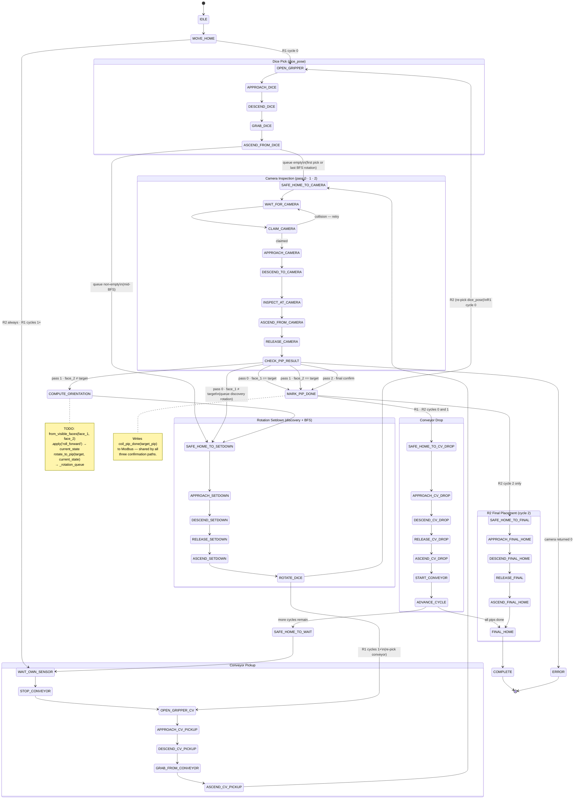

# Robot Task — State Diagram

---

## Path summary

| Path | Condition | Camera visits | Rotations |
|------|-----------|--------------|-----------|
| Fast 1 | face_1 == target | 1 | 0 |
| Fast 2 | face_2 == target (after discovery) | 2 | 1 |
| Full BFS | face_1 ≠ target, face_2 ≠ target | 3 | 1 + N (BFS) |

## Key conditional transitions

| State | Condition | Next |
|-------|-----------|------|
| `MOVE_HOME` | R1, cycle 0 | `OPEN_GRIPPER` |
| `MOVE_HOME` | R2 / R1 cycle 1+ | `WAIT_OWN_SENSOR` |
| `ASCEND_FROM_DICE` | `_rotation_queue` empty | `SAFE_HOME_TO_CAMERA` |
| `ASCEND_FROM_DICE` | `_rotation_queue` non-empty | `SAFE_HOME_TO_SETDOWN` |
| `ROTATE_DICE` | R2 or R1 cycle 0 | `OPEN_GRIPPER` |
| `ROTATE_DICE` | R1 cycles 1+ | `OPEN_GRIPPER_CV` |
| `MARK_PIP_DONE` | R2 cycle 2 | `SAFE_HOME_TO_FINAL` |
| `MARK_PIP_DONE` | all others | `SAFE_HOME_TO_CV_DROP` |
| `ADVANCE_CYCLE` | pips remain | `SAFE_HOME_TO_WAIT` |
| `ADVANCE_CYCLE` | all pips done | `FINAL_HOME` |
